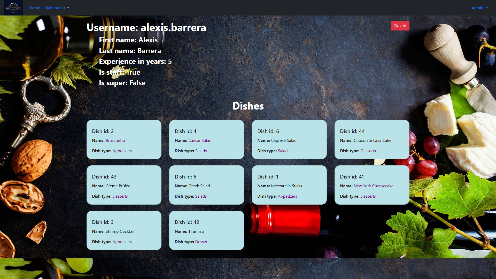

# Restaurant Kitchen Service

Django project for managing cooks, dishes and dish types in a restaurant

## Check it out!

[Restaurant service project deployed to Render](https://restaurant-service-hiyj.onrender.com/)

## Installing / Getting started
Python3 must be already installed

````shell
git clone https://github.com/YevheniiIovchu/Restaurant-Kitchen-Service.git
cd Restaurant-Kitchen-Service
python -m venv venv
venv\Scripts\activate (on Windows)
source venv/bin/activate (on macOS)
pip install -r requirements.txt
python manage.py loaddata data.json  # it can take ~minute
python manage.py makemigrations db
python manage.py migrate
python manage.py runserver
````

## Features
There are 3 levels of access: for staff, superuser and unauthorized.

Chef cook(superuser) can create/delete(hire/fire) another cooks. This super can manage dishes and dish types.

Cook(staff) can enter just his own profile, see all another cooks in list and update dishes.

Unauthorized user can just see dishes and dish types with detailed information without editing.
## Licensing
"The code in this project is licensed under MIT license."

## Default users
superuser
````
username: admin
password: 1w2q3r4e5y6t
````
staff
````
username: new_cook
password: 1w2q3r4e5y6t
````
## Demo

